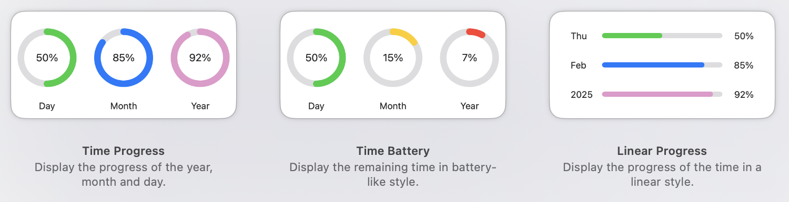

TimeProgress 是一个小型 macOS widget app，用来把当天、当月和当年的时间进度放在桌面上，方便随时感知时间流逝。

- 使用 SwiftUI 和 WidgetKit 实现 small 和 medium 两种尺寸的 Home Screen widget。
- 设置每 15 分钟自动刷新，保持进度显示及时更新。
- 使用动态颜色区分不同进度状态，让信息更容易扫读。

##### Demo

##### 链接

- [代码](https://github.com/ANKer661/TimeProgress)
