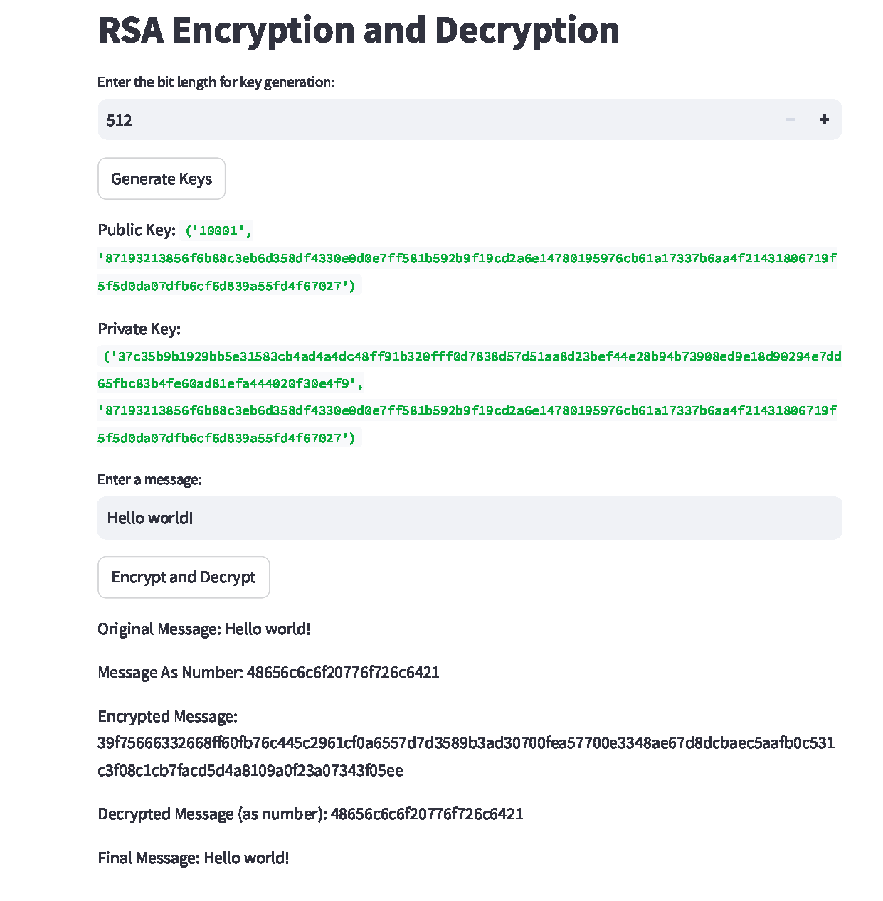

一个用 Python 和 Streamlit 实现的 RSA 加密 / 解密玩具项目，用来展示 RSA 的完整流程和中间步骤。

- 实现了可自定义 bit length 的 RSA key generation。
- 实现了 prime number generation 和 Miller-Rabin primality testing。
- 构建了核心 encryption / decryption 操作，以及消息预处理和后处理工具。
- 添加 Streamlit demo，用于展示中间计算步骤和最终加密 / 解密结果。

##### Demo

##### 链接

- [代码](https://github.com/ANKer661/Toy_RSA)
- [在线 Demo](https://anker661-toy-rsa-rsa-demo-app-isyesw.streamlit.app/)
